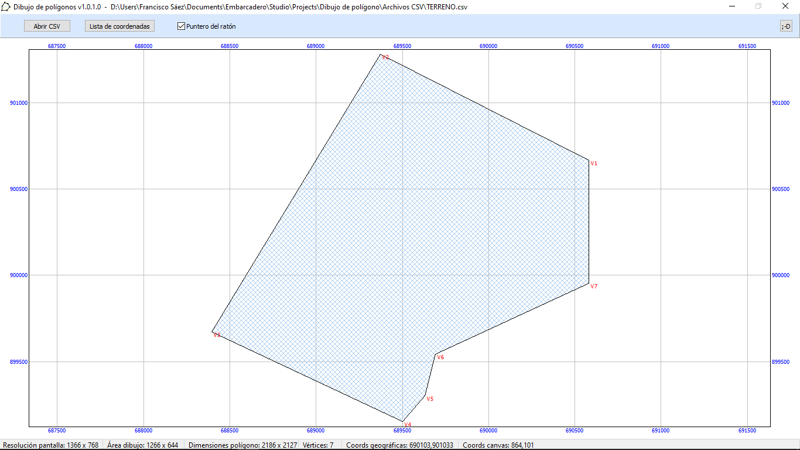
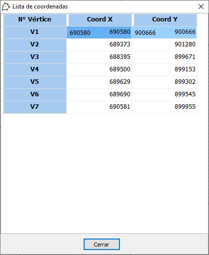
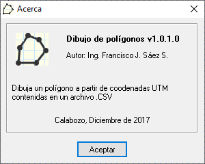

# Dibujo-de-poligonos

---
## Descripción
Aplicación simple que dibuja un polígono irregular a partir de coordenadas contenidas en un archivo CSV.

## Lenguaje/framework

* Lenguaje: Delphi 10.2 Tokyo, empleando sólo componentes nativos. 
* Framework: VCL. 

---

## Autor

Ing. Francisco José Sáez Soto.

e-mail: **fjsaez@gmail.com**

LinkedIn: **linkedin.com/in/francisco-josé-sáez-soto**

GitHub: **github.com/fjsaez**

---

Calabozo (Venezuela), diciembre de 2017.

---

## Imágenes de la aplicación

### Icono

### Pantalla principal

### Listado de coordenadas

### Acerca...

## Link de descarga del ejecutable

https://mega.nz/file/W5FAjAhD#GO526v27hnMsi96y75PI9f4H5Eiab1p7yHlbUt9LVeE